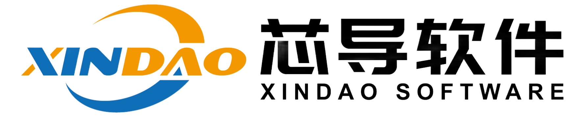

<div align="center">

<h1>文若 RAG</h1>
<p>面向线缆工程采购场景的标准、技术规范、BOM 与质检资料检索和问答平台。</p>
<p><a href="./README.md">English</a> · <a href="./README_zh.md">简体中文</a> · <a href="./LICENSE">Apache-2.0</a></p>
</div>

## 先选对启动方式

本分支是客户交付分支，基于 RAGFlow 二次开发，使用 Python 后端。客户启动入口是 `delivery/manage.py`，Compose 文件是 `delivery/compose.yaml`。旧的 `docker/docker-compose.yml` 和 `tools/scripts/start_deployment.py` 不在此分支，不要复制旧命令启动。

| 场景 | 命令（源码根目录） | 浏览器入口 |
| --- | --- | --- |
| 已初始化的客户/验收环境 | `python delivery/manage.py start` | 初始化时选定的端口，默认 `http://localhost:9222/login` |
| 新机器首次部署 | 先执行下方 `init`，再 `start` | 默认 9222；占用时初始化选择 19222 |
| 本地前端开发 | 启动可用后端并配置代理，再 `npm run dev -- --port 5173` | `http://localhost:5173` |

19222 是既有隔离验收环境使用的端口，不是所有安装的默认值。切换 Git 分支或新建 clone 目录不会自动迁移资料，也不会自动隔离原数据库。

## 客户部署：先准备三个部分

- **源码**：Git 仓库或 `source.zip`，包含程序和部署脚本。
- **镜像**：`images.tar` 与 `images.json`，包含应用和固定版本的中间件。
- **业务数据**：`business-data.zip`，包含选定 PDF、解析切片、向量、文档元数据、助手配置和已有 Wiki；不是完整私人数据库转储。

Git clone 和 docker load 都不会自动恢复解析好的资料。业务包是单独交付文件，不在 Git 中。只交付审查通过的发布目录；不要发送其父目录、私人备份或 `delivery/private`。

### 环境要求

需要 Docker（含 Compose；Windows 推荐 Docker Desktop/WSL2）和主机 Python 3.10+，用于标准库部署脚本。离线导入已构建镜像不需要 Node.js、uv 或主机 Python 后端依赖。建议至少 4 核、16 GB RAM、50 GB 可用磁盘，并为镜像导入和构建预留额外空间。

客户应用通过一个 Web 端口提供服务；MySQL、Elasticsearch、MinIO 和 Redis/Valkey 不向主机发布端口。离线环境必须拿到包含所有依赖镜像的完整包，仅构建应用镜像不足以部署。

### 首次部署（Windows PowerShell）

示例发布目录为 `C:\wenruo\release`。先用 `SHA256SUMS.txt` 核对交付文件，以下目录须是本次专用的新目录：

```powershell
cd C:\wenruo\release
Get-FileHash source.zip,images.tar,business-data.zip -Algorithm SHA256
Expand-Archive -LiteralPath source.zip -DestinationPath C:\wenruo\source
Expand-Archive -LiteralPath business-data.zip -DestinationPath C:\wenruo\business-data
docker load -i images.tar
cd C:\wenruo\source
python delivery/manage.py init --project wenruo-delivery-customer01 --image wenruo:customer-release --revision 57cea96304b9fb840aa1f6291016354e74ab4f13 --package C:/wenruo/business-data
python delivery/manage.py start
```

提交号对应 2026-10-05 已验收镜像；未来发布请以配套交付报告中的镜像和提交号为准。项目名须唯一且以 `wenruo-delivery-` 开头。若 9222 已占用，在首次 init 命令末尾添加 `--port 19222`；不要停止不属于本项目的服务。

init 只运行一次，会校验业务包、固定镜像、端口和已有资源，并生成本机配置。start 会启动服务、等待后端就绪、恢复资料并校验恢复结果；看到容器 Started 不等于完成。默认等待最多 600 秒，浏览器出现 502 时先看初始化日志。

### 账号、资料与模型

唯一初始账号为 `admin@wenruo.local`，同时拥有超级管理员和工作区 Owner 权限。密码在客户本机首次初始化时随机生成，保存于 `delivery/private/admin-password.txt`；数据库密码、会话密钥和登录 RSA 私钥也在本机生成。不要上传或复制该目录，不要给客户开发机的密码。

2026-10-05 已验收业务包包含 **3 个知识库、18 份 PDF、797 条切片及文档向量、18 条文档元数据、3 个正式助手、579 篇 Wiki**。16,135 是 Wiki 索引记录数，不是 Wiki 篇数。具体数量以配套 `DELIVERY-REPORT.txt` 为准。

私人用户、聊天记录、API Token 和模型 Key 不迁移。管理员需在模型管理中配置客户自己的提供方、地址和 Key。保留了模型名称和绑定，不等于模型已可调用；文档查询 embedding 必须与原有 3072 维向量空间兼容，不能只靠维度相同就随意换模型。

已有 Wiki 可阅读，管道和模板已保留；后续生成仍需管理员绑定管道并配置模型，部署不会自动覆盖正式库解析配置。没有模型配置时不能把启动成功宣称为问答验收通过。

## 日常启动、日志与停止

在已 init 的同一个源码目录执行：

```powershell
python delivery/manage.py start
```

重复 start 会校验恢复回执，不重复创建账号或重新生成密码。需要查看或停止此项目时，可在 PowerShell 定义：

```powershell
$project=(Get-Content delivery/private/identity.json -Raw | ConvertFrom-Json).project
function dc {
  docker compose --project-name $project --env-file delivery/private/runtime.env -f delivery/compose.yaml --profile cpu @args
}
dc ps
dc logs --tail 100 wenruo-rag-cpu
# 停止服务，保留数据：
dc stop
# 移除容器和网络，保留命名数据卷：
dc down
```

恢复运行仍用 manage.py start。不要为排错执行 `down -v`、删除数据卷或重新生成 private 配置；这可能丢失资料或导致密码与存量数据库不一致。不要手改 runtime.env，管理脚本会拒绝不匹配的配置。

## 完整构建与升级镜像

修改打进镜像的代码后，restart 不会更新代码。此分支使用完整 Dockerfile 构建；不推荐向旧容器覆盖文件或依赖 latest 判断版本。

从源码构建需要 Node.js 22、Docker 和联网下载构建依赖。先在源码根目录编译前端：

```powershell
cd web
npm ci
$env:NODE_OPTIONS='--max-old-space-size=4096'
$env:VITE_BUILD_SOURCEMAP='false'
$env:VITE_MINIFY='esbuild'
npm run build
cd ..
$revision=(git rev-parse HEAD).Trim()
docker build --build-arg WEB_DIST_MODE=prebuilt --build-arg SOURCE_COMMIT=$revision -t wenruo:customer-updated .
```

source.zip 不含 .git，使用 ZIP 时将 $revision 直接赋值为对应交付报告中的发布提交号。prebuilt 会把本机 web/dist 放进镜像；前端有改动必须先重新编译，不能带旧 dist 构建。

已初始化环境升级：

```powershell
python delivery/manage.py set-image --image wenruo:customer-updated
python delivery/manage.py start
```

set-image 显式更新镜像和版本，保留凭据、资源标记和恢复回执。首次部署使用 init。正式重新交付时，应重新验收并生成配套镜像包、源码包、业务包和校验清单；docker save 仅导出镜像，不包含运行数据卷。

## 本地源码开发

客户 Compose 仅发布 Web 端口，未发布 9380/9381。当前 Vite 的 Python 代理默认指向主机 `127.0.0.1:9380`（/api、/v1）与 `9381`（管理 API），因此不能直接对客户栈运行 npm dev 并期待问答正常。

推荐使用独立开发环境，配置 Vite 代理指向可用 API，再运行：

```powershell
cd web
npm ci
npm run dev -- --port 5173
```

若开发后端也跑在 Docker，可通过专用开发配置发布 API 或将代理指向后端 Web 入口；不要改客户的 private/runtime.env。不要与客户栈共用数据库、队列或项目名。

主机 Python 深度调试需要 Python 3.13、uv、完整依赖及独立的 MySQL/ES/MinIO/Redis 服务。先配置本机 conf/service_conf.yaml 的地址、端口和凭据；Docker 内服务名不能直接当主机地址使用。停止对应容器后台任务，避免两套 worker 消费同一队列，然后分别运行：

```powershell
# 安装 Python 依赖：
uv sync --python 3.13
# 终端 1：API
$env:PYTHONPATH="."
$env:PYTHONUTF8="1"
uv run python api/wenruo_server.py
# 终端 2：任务后台（在另一个终端运行）
$env:PYTHONPATH="."
$env:PYTHONUTF8="1"
uv run python rag/svr/task_executor.py
```

前端由第三个终端运行，确认代理匹配 API。Python 服务改动后按需要重启，不保证全链路热重载。这是开发流程，不是客户安装步骤。

## 排错与验收

| 现象 | 先检查 |
| --- | --- |
| 找不到 docker/docker-compose.yml | 本分支使用 delivery/manage.py 和 delivery/compose.yaml |
| 端口占用 | docker ps；首次 init 选择空闲端口 |
| 502 / ERR_EMPTY_RESPONSE | 此项目状态与应用日志；等待 API 就绪，检查数据库健康 |
| 配置或密码不匹配被拒绝 | 保留原 private 与数据卷，查来源；不要重置密码文件 |
| 模型配置缺失 | 配置客户模型和 Key，检查地址、额度及 embedding 兼容性 |
| Wiki 正文可读但不能生成 | 检查模型、管道绑定、模板和准备状态 |

验收应使用无痕窗口，确认未登录时进入登录页；登录后检查唯一管理员、3 个知识库/助手、PDF、切片、元数据及 Wiki。模型配置完成后另做检索与问答验证。HTTP 200、容器 Started 或有界面均不能替代恢复校验。

## 文档与开发约定

- [交付流程与数据边界](./delivery/README.md)
- [管理员与开发文档](./docs/)
- [文档理解与 OCR](./deepdoc/README.md)
- [许可证](./LICENSE)

保持改动聚焦，使用与改动相关的检查；不要提交私人配置、账号密码、模型 Key、业务资料或客户数据。README 命令从源码根目录执行，多行 PowerShell 续行符须保留；本页示例采用单行命令以便复制。
